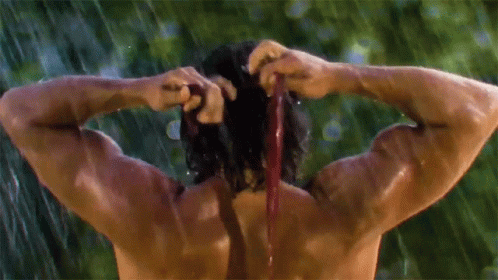

    <h1>Daily Challenges</h1>
    

## 📝 Table of Contents
- [About](#about)
- [Getting Started](#getting_started)
- [Authors](#authors)
- [License](#license)

## 🧐 About 
This is a simple project used to train daily challenges in JavaScript, maybe I will add another language later. I'm using Chat GPT to generate the challenges. I'm trying to solve them in the best way possible. I'm also using this project to learn new things about the language and specially about the DOM.

## 🏁 Getting Started 
You can clone this repository and run the files in your local machine.

## ✍️ Authors 
- [@igor-castilhos](https://www.linkedin.com/in/igorcastilhos/)
